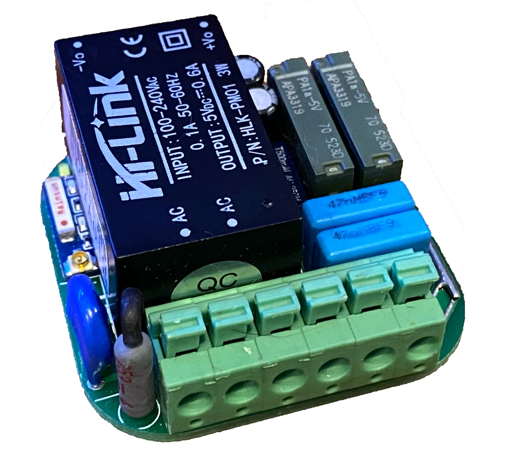

# ESPHome HVIO Module WebInstaller

ESPHome Configuration for:
[https://luani.de/projekte/esp8266-hvio](https://luani.de/projekte/esp8266-hvio)

It includes a GitHub workflow that will automatically build the configuration(s) and then deploys a simple 
website via GitHub pages that utilises [ESP Web Tools](https://esphome.github.io/esp-web-tools/) for users to 
easily install your project onto their device.

## Instructions
Open: [https://yannik25.github.io/esphome_hvio_configuration/](https://yannik25.github.io/esphome_hvio_configuration/) and follow instructions.
